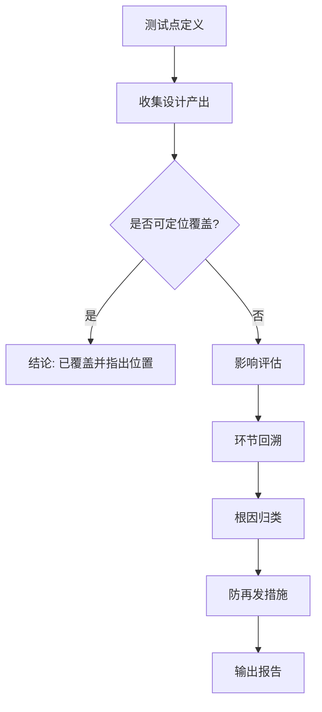

# 测试点漏测 Debug（test_point_gap_debug）

## 1. 适用场景

| 场景 | 说明 |
|------|------|
| 单点质疑 | 已明确一个测试点（条件/场景/接口字段/状态流转），怀疑设计稿未覆盖 |
| 缺陷后复盘 | 线上/测试发现缺陷，回溯测试设计是否本应覆盖 |
| 分片合并后 | 合并稿或中间稿与预期不一致，定位遗漏发生在哪一环节 |
| 流程改进 | 需要可复用的防再发机制，而非一次性解释 |

---

## 2. 输入要求

执行前向用户确认或自行从对话中提取：

| 输入 | 说明 |
|------|------|
| **测试点定义** | 一句话 + 可选细化：前置、输入、操作、预期、关联需求/接口/界面 |
| **设计产出位置** | 合并稿 `merged_test_design.md`、分片稿、对照说明 `merge_traceability_and_gaps.md`、需求/接口文档路径等（用户未给则**在仓库内搜索**常见目录与文件名） |
| **判定口径** | 「覆盖」指：该测试点在合并/最新设计稿中有**可定位条目**（标题、表格行、条件列表），或能明确映射到某用例 ID；仅有笼统表述不算覆盖 |

若测试点模糊，先**澄清边界**再判定漏测，避免误判。

---

## 3. 执行流程

1. **固化测试点**：写成可检查的一条「测试条件」或「场景描述」，便于全文检索与对照。
2. **收集设计产出**：读取合并稿、分片、对照说明、评审记录；若存在 **[test_design_merge](../test_design_merge/SKILL.md)** 产出的**缺口表**，优先核对是否曾标记遗漏。
3. **覆盖判定**：
   - 在合并稿/主设计稿中检索关键词、同义表述、上级功能域是否已隐含覆盖；
   - 若仅在某分片存在而未进合并稿 → 记为**合并环节漏载**；
   - 若完全不存在 → 记为**设计生成漏测**（再细分根因）。
4. **漏测时：影响评估**（第 4 节）：对业务、安全、数据、用户、发布节奏分级。
5. **回溯链路**（第 5 节）：从现象到输入材料、分片策略、提示词、模型能力、人工评审、合并规则逐步归因。
6. **根因归类**（第 6 节）：每条原因需对应**可验证证据**（引用文档段落、缺口表行、需求缺失等）。
7. **防再发措施**（第 7 节）：必须**具体可执行**（谁、何时、用什么模板/清单/自动化/门禁）。
8. **输出**（第 8 节模板）。



---

## 4. 漏测影响程度（建议分级）

| 级别 | 适用情况 | 示例方向 |
|------|----------|----------|
| **高** | 核心交易/资金/权限/安全合规；可导致资金损失、越权、数据破坏或监管问题 | 支付双花、管理员越权、PII 泄露 |
| **中** | 主要功能错误、常见用户路径、重要接口契约；显著影响质量或交付信心 | 主流程失败、错误码与约定不一致、关键状态机缺口 |
| **低** | 边缘展示、低频操作、体验类、易在系统测试中发现的问题 | 文案、非关键排序、极端边界 |
| **待定** | 信息不足 | 在报告中列出需产品/架构确认的前提 |

---

## 5. 环节回溯（从后往前）

按顺序检查，并在报告中**标注最早可阻断漏测的环节**：

| 顺序 | 环节 | 查什么 |
|------|------|--------|
| 1 | **合并与溯源** | 分片是否曾覆盖但**未进入合并稿**；`merge_traceability_and_gaps.md` 缺口表、去重是否误合并 |
| 2 | **设计评审与 Review** | 是否未执行或未对照 **[test_design_review](../test_design_review/SKILL.md)** 中 Checklist（需求、功能、接口、非功能等） |
| 3 | **设计生成（LLM/人工）** | 提示词是否要求等价类/边界/负向；输出模板是否强制「测试条件列表」 |
| 4 | **上下文与分片** | 单次上下文是否未包含该模块需求；分片边界是否把相关规则切到另一批 |
| 5 | **输入材料** | 需求/接口文档是否未写清该规则；变更未同步到设计输入 |
| 6 | **范围与假设** | 设计范围声明是否显式排除某类测试（若排除是否合理） |

---

## 6. 根因归类（可多选）

分析时从下列标签中选择，并**避免仅用「模型不聪明」笼统收尾**；若涉及模型能力，须同时给出**流程或提示词上的补偿措施**。

| 类别 | 典型表现 | 证据示例 |
|------|----------|----------|
| **输入材料缺失** | 需求/接口无该规则或仅有口头约定 | 文档中无对应条目 |
| **材料滞后** | 需求变更未进入设计输入 | 变更记录与设计稿日期不一致 |
| **上下文不足** | 分片未包含依赖章节；合并丢失 | 分片 A 有规则 B 无；缺口表非空 |
| **提示词/模板不足** | 未要求负向/边界/状态机/接口参数组合 | 历史对话或模板缺失字段 |
| **模型/工具局限** | 长文档摘要丢失细节；复杂组合未展开 | 同材料重试可复现遗漏模式 |
| **流程未执行** | 未 merge、未 review、未走对照说明 | 无 merge 产出或 review 记录 |
| **人为疏漏** | 评审通过但未勾选某维度 | 评审签字与 Checklist 空项 |
| **误判为已覆盖** | 合并稿用语笼统，实际不可执行 | 「其他异常」类占位无步骤 |

---

## 7. 防再发措施（必须可落地）

每条措施需满足 **SMART 倾向**：可执行、可检查、可归责。示例类型（按实际情况选用，勿空洞）：

| 类型 | 示例 |
|------|------|
| **门禁** | 合并交付前「缺口表必须为空」或「非空须书面签字排除」 |
| **模板** | 测试设计输出强制包含「测试条件 ID + 需求追溯列」 |
| **分片策略** | 按状态机/接口域分片时，附加一页「跨分片依赖清单」作为每批必附上下文 |
| **提示词** | 固定追加：「列出负向与边界；若需求未写请单列假设待确认」 |
| **自动化辅助** | 用脚本对合并稿做关键词/需求 ID 覆盖率扫描（与需求列表比对） |
| **评审** | 对高影响模块强制走 **test_design_review** 全量 Checklist 或裁剪声明 |
| **合并** | 强制使用 **test_design_merge** 对照文档，漏映射条目不得关闭任务 |

禁止仅写「加强沟通」「提高意识」作为唯一措施。

---

## 8. 输出报告模板

```markdown
# 测试点漏测 Debug 报告

## 1. 测试点定义
- **描述**: 
- **判定口径**: 

## 2. 已查阅的设计产出
| 文件/文档 | 路径 | 结论（命中/未命中/部分） |
|-----------|------|--------------------------|

## 3. 覆盖结论
- **是否漏测**: 是 / 否 / 待确认
- **依据**: （引用标题、表格行、或检索说明）

## 4. 影响评估
- **级别**: 高 / 中 / 低 / 待定
- **理由**: 

## 5. 环节回溯摘要
| 环节 | 是否有问题 | 说明 |
|------|------------|------|
| 合并与溯源 | | |
| 设计评审 | | |
| 设计生成 | | |
| 上下文与分片 | | |
| 输入材料 | | |

## 6. 根因（带证据）
1. 
2. 

## 7. 防再发措施（可执行）
| 序号 | 措施 | 负责人/角色 | 触发时机 | 完成标准 |
|------|------|-------------|----------|----------|
| 1 | | | | |

## 8. 待确认项
- 
```

---

## 9. 与项目内 Command 的协作

- **设计质量门禁**：漏测若发生在「未系统性评审」，建议后续对同范围执行 **[test_design_review](../test_design_review/SKILL.md)**。
- **分片合并**：若漏测来自合并丢失，强化 **[test_design_merge](../test_design_merge/SKILL.md)** 的映射表与缺口表闭环。

---

## 10. 执行检查清单

- [ ] 测试点已写清且可检索  
- [ ] 已查找合并稿、分片、对照说明（若存在）  
- [ ] 覆盖结论有明确文档锚点或「全文未命中」说明  
- [ ] 影响级别已给出理由  
- [ ] 根因标签与证据一一对应  
- [ ] 防再发措施可执行、可验收，非空话  
