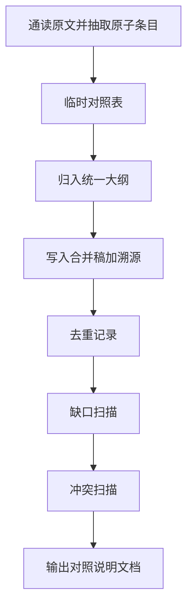

# 测试设计合并（test_design_merge）

## 1. 适用场景

| 场景 | 说明 |
|------|------|
| 分片生成 | 受上下文限制，按模块/需求批次/文件多次生成测试设计，需汇总为一份 |
| 多文件中间稿 | 多人或多轮产出的片段需统一版本与结构 |
| 可追溯交付 | 需要证明合并稿覆盖所有原始条目，并记录去重与冲突 |

---

## 2. 合并原则（硬约束）

| 原则 | 要求 |
|------|------|
| **不丢信息** | 原文中每条**可独立语义**的信息（测试条件、用例要素、数据说明、规程、矩阵行等）在合并稿中必须有**可定位承载**；禁止仅写「已涵盖」而不落条。 |
| **允许去重** | 语义等价内容合并为一条时，必须在**对照说明文档**的「去重/归并记录」中列出**全部来源**。 |
| **冲突显式化** | 不同原文对同一对象描述矛盾时：合并稿中并列保留或标注「待确认」，并在对照文档中单列**冲突项**。 |

**默认溯源方式**：合并稿中对每个主要小节或每条关键条目使用 HTML 注释标注来源，便于 diff 与机器解析：

`<!-- source: <原始文档ID>#<章节或锚点> -->`

若用户要求「正文可见来源」，可改为在条目下增加 **来源** 子列表（与注释二选一，同一合并任务内保持一致）。

---

## 3. 输入约定

执行合并前须明确：

- **原始文档清单**：每份材料的稳定 **文档 ID**（建议：文件名或 `批次ID_日期`），与内容一一对应。
- **合并范围**：是否包含非功能、接口专章、UI 专章等（可裁剪统一大纲）。
- **输出路径与文件名**：默认见第 5 节；用户可指定目录与 basename。

若文档 ID 缺失，**先请用户补齐**再合并，避免对照表无法填写。

---

## 4. 合并流程

按顺序执行，并在对照文档中同步更新映射与缺口。

1. **通读各原文**：列出各文档的章节结构与条目层级。
2. **抽取原子条目**：粒度以「单条测试条件」或「单条用例大纲」为主（随原文结构微调）；每条分配临时 **条目键**（如 `SRC01-T012`）。
3. **建立临时对照表**：`文档ID | 原文位置（标题路径/序号） | 摘要 | 条目键`。
4. **归类到统一大纲**（可按项目裁剪），建议默认结构：
   - 范围、假设与术语
   - 需求/功能与测试条件
   - 测试用例（或大纲）
   - 测试数据
   - 测试规程与执行顺序
   - 非功能与安全（若原文涉及）
   - 风险、依赖与环境
5. **写入合并稿**：逐条落入合并结构，并加上 `<!-- source: ... -->`（或可见「来源」）。
6. **去重处理**：语义相同的条目合并为一条，在对照文档记录「合并后条目 ID ← 多来源」。
7. **缺口扫描**：对每个原子条目，检查合并稿是否存在对应内容或明确引用；**找不到则写入对照文档「相对合并稿缺失」表**（目标为空；非空须后续补全或人工确认）。
8. **冲突扫描**：矛盾表述写入合并稿「待确认」区及对照文档「冲突与待确认」。



---

## 5. 输出物

| 文档 | 默认文件名 | 说明 |
|------|------------|------|
| **A 合并稿** | `merged_test_design.md` | 单一真相源，结构清晰，带 source 注释或可见来源 |
| **B 对照说明** | `merge_traceability_and_gaps.md` | 原文清单、映射、去重、冲突、缺口 |

文件名与目录可由用户在任务中指定；两处文档应保存在**同一目录**便于评审。

---

## 6. 文档 A 模板（合并稿）

```markdown
# 测试设计（合并稿）

> - **合并日期**: YYYY-MM-DD
> - **涵盖原始文档**: （列出文档 ID）
> - **合并说明**: 本分片合并策略简述（如：按功能域归并、去重规则）

## 1. 范围、假设与术语

<!-- source: <文档ID>#<章节> -->
（内容）

## 2. 需求/功能与测试条件

### 2.x <主题>
<!-- source: <文档ID>#<章节> -->
- ...

## 3. 测试用例（大纲）

### 3.x <用例组或模块>
<!-- source: <文档ID>#<章节> -->
| ID | 标题 | 前置 | 步骤摘要 | 数据要点 | 预期 |
|----|------|------|----------|----------|------|
| ... | ... | ... | ... | ... | ... |

## 4. 测试数据

<!-- source: <文档ID>#<章节> -->
（内容）

## 5. 测试规程与执行顺序

<!-- source: <文档ID>#<章节> -->
（内容）

## 6. 非功能与安全（若适用）

<!-- source: <文档ID>#<章节> -->
（内容）

## 7. 风险、依赖与环境

<!-- source: <文档ID>#<章节> -->
（内容）

## 8. 待确认项（冲突或未决）

| 编号 | 主题 | 原文 A 观点 | 原文 B 观点 | 建议 |
|------|------|-------------|-------------|------|
| P1 | ... | ... | ... | ... |
```

---

## 7. 文档 B 模板（对照说明：可追溯与缺口）

```markdown
# 测试设计合并 — 对照说明与缺口

> - **合并稿**: `merged_test_design.md`（路径）
> - **生成日期**: YYYY-MM-DD

## 1. 原始文档清单

| 文档 ID | 说明/版本 | 路径或引用 |
|---------|-----------|------------|
| SRC01 | ... | ... |
| SRC02 | ... | ... |

## 2. 映射表（原文 → 合并稿）

| 文档 ID | 原文位置（标题/序号） | 条目键 | 合并稿位置（章节路径或表格行 ID） |
|---------|------------------------|--------|-----------------------------------|
| SRC01 | ... | SRC01-T001 | ## 2.x / 表格行 UC-001 |
| ... | ... | ... | ... |

## 3. 去重/归并记录

| 合并后条目/锚点 | 语义说明 | 来源（文档 ID + 位置） |
|-----------------|----------|-------------------------|
| UC-合并-01 | ... | SRC01 §3.2；SRC02 用例表行 5 |

## 4. 冲突与待确认

| 编号 | 涉及文档 | 冲突摘要 | 合并稿中的处理方式 |
|------|----------|----------|--------------------|
| C1 | SRC01 vs SRC02 | ... | 已列入合并稿 §8 待确认 |

## 5. 缺口表（原文相对合并稿：未找到对应）

> **目标**：本表应为空。若存在条目，表示合并稿未承载该条语义，须补写或说明刻意排除原因。

| 文档 ID | 原文位置 | 条目键 | 摘要 | 处理状态（待补全/排除说明） |
|---------|----------|--------|------|----------------------------|
| | | | | |

## 6. 合并自检摘要

- 原子条目总数：N
- 已映射：M
- 去重归并：K 组
- 冲突：C 条
- 缺口：G 条（应为 0）
```

---

## 8. 执行检查清单

合并交付前自检：

- [ ] 每份原始文档均已列入「原始文档清单」，且 **文档 ID** 稳定可读  
- [ ] 合并稿中每条关键信息带有 **source 注释**（或统一的可见「来源」格式）  
- [ ] 「映射表」覆盖所有原子条目，或与「缺口表」一致（无遗漏登记）  
- [ ] 所有去重均在「去重/归并记录」中列出**全部来源**  
- [ ] 冲突已出现在合并稿「待确认」及对照文档「冲突与待确认」  
- [ ] **缺口表为空**，或每条缺口有明确后续动作（补写合并稿 / 书面排除原因）  

---

## 9. 可选后续步骤

合并稿稳定后，可使用项目内 **[test_design_review](../test_design_review/SKILL.md)** command 对合并结果做测试设计质量评审（覆盖度、冗余、可追溯等）。
