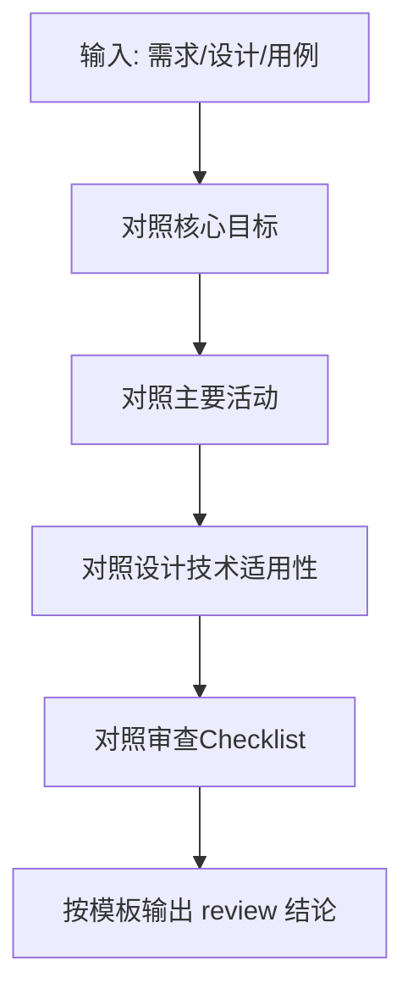

# 测试设计 Review（test_design_review）

## 1. 适用场景

在以下情况按本 command 执行 review：

| 场景 | 说明 |
|------|------|
| 评审测试设计文档 | 需求/功能对应的测试点、用例大纲、覆盖矩阵 |
| 评审测试用例集 | 用例标题、前置、步骤、数据、预期是否完整且合理 |
| 评估覆盖与冗余 | 是否遗漏关键风险、是否存在大量重复低价值用例 |
| 可追溯性检查 | 用例与需求条目、用户故事、技术风险是否可一一对应 |

---

## 2. Review 流程

按顺序执行，并在结论中体现各步结果：

1. **收集输入**：明确被测范围（需求/接口/模块）、已有的测试条件/用例/数据/规程说明。
2. **对照核心目标**（第 3 节）：逐项判断是否满足「找缺陷导向、覆盖、去冗余、可追溯」。
3. **对照主要活动**（第 4 节）：检查是否完成测试条件拆解、用例要素、测试数据、执行规程。
4. **对照设计技术**（第 5 节）：判断当前场景下哪些技术适用；若适用却未体现，记为改进项。
5. **对照审查 Checklist**（第 6 节）：按项目范围裁剪，系统化检查常见遗漏点（需求、功能、接口、UI、流程、非功能等）。
6. **输出**（第 7 节）：使用统一模板给出结论、问题与建议。



---

## 3. 测试设计核心目标（评判标准）

| 目标 | Review 要点 |
|------|-------------|
| **发现缺陷** | 设计是否以暴露问题为导向，而非仅验证「能跑通」；是否包含负向、异常、组合与边界 |
| **覆盖全面** | 功能路径外，是否考虑性能、安全、兼容性等约定维度（按项目范围取舍并说明） |
| **避免冗余** | 是否可用更少用例覆盖等价场景；重复步骤是否可合并或用参数化/正交压缩 |
| **可追溯** | 每条用例或测试条件能否对应到具体需求 ID、业务规则或已识别的技术风险 |

---

## 4. 测试设计主要活动（检查点）

### 4.1 识别测试条件

- 是否从需求中拆解出可验证的测试点（例：登录——正确凭据、错误用户名、空密码、大小写敏感等）。
- 条件之间是否互斥或可合并为等价类，避免遗漏关键分支。

### 4.2 设计测试用例

标准用例应包含并可核对：

- 用例标题  
- 前置条件  
- 测试步骤  
- 输入数据  
- 预期结果  

### 4.3 设计测试数据

- 是否区分：正常业务数据、边界值（最大/最小长度、金额上下限等）、异常/恶意数据（特殊符号、注入类 payload 等，按安全测试范围）。
- 数据是否与步骤、预期一一对应，可复现。

### 4.4 设计测试规程

- 执行顺序是否说明：冒烟优先、依赖环境或数据状态的用例是否分组或标注依赖。
- 是否需要回归子集与全量集的划分说明。

---

## 5. 常见测试设计技术（覆盖度检查）

对**当前被测特性**判断技术是否适用；适用则应能在设计中找到对应体现（显式表格、场景列表、状态图说明等均可）。

| 技术 | 适用情况 | Review 检查要点 |
|------|----------|-----------------|
| **等价类划分** | 输入域可分区 | 有效/无效类是否列出；每类是否有代表用例；是否避免同类重复 |
| **边界值分析** | 有明确上下限 | 是否覆盖边界及邻值（如范围 1–120：0、1、2、119、120、121） |
| **场景法（业务流程）** | 端到端或用户旅程 | 是否有基本流；是否有备选流（取消、失败、超时、余额不足等） |
| **判定表/决策表** | 多条件组合决定结果 | 条件组合是否完整、无遗漏、无矛盾 |
| **状态转换图** | 实体状态多且可流转 | 是否覆盖合法转换与非法转换；终态与取消类路径 |
| **正交试验法** | 多因素多水平组合爆炸 | 是否用正交或类似策略压缩用例数且保留代表组合 |

若某技术**不适用**，在 review 结论中简要说明原因即可，不强行要求。

---

## 6. 审查 Checklist（常见遗漏点清单）

以下 Checklist 从多个维度系统化检查测试设计完整性；**按被测类型与项目约定裁剪或增补**，不适用项在报告中注明「本次范围不涉及」即可。

### 6.1 需求覆盖度

- [ ] 是否所有需求条目（用户故事、功能点）都有对应的测试条件？
- [ ] 是否覆盖了需求中隐含的非功能性要求（如响应时间、并发数）？
- [ ] 是否考虑了业务规则的边界和组合（如复杂判定表、状态机）？
- [ ] 是否遗漏了需求变更部分？

### 6.2 功能测试设计

- [ ] 是否采用了多种设计技术（等价类、边界值、场景法、判定表等）？
- [ ] 正常场景（Happy Path）是否完整覆盖？
- [ ] 异常场景（Negative）是否充分？包括：无效输入、网络中断、服务端返回错误、超时、权限不足等。
- [ ] 是否覆盖了状态的流转（状态转换图）？
- [ ] 是否考虑了数据依赖和前置条件？如某些用例必须依赖特定数据状态。

### 6.3 接口与数据层

- [ ] 接口测试是否覆盖了请求参数的各种组合（必填/非必填、类型、长度、业务约束）？
- [ ] 是否验证了接口的响应数据结构、字段类型、错误码规范？
- [ ] 是否考虑了接口幂等性、并发安全？
- [ ] 数据计算验证：是否有明确的验证方法（如手工计算、数据库校验）？

### 6.4 UI 与前端

- [ ] UI 组件测试：是否覆盖了不同状态（禁用/启用、可见/隐藏、加载中）？
- [ ] 是否测试了页面初始化数据加载、默认值？
- [ ] 交互反馈：按钮点击效果、加载动画、成功/失败提示是否设计？
- [ ] 前端逻辑：如表单校验（正则、长度、必填）是否与后端一致？

### 6.5 用户场景与业务流程

- [ ] 是否设计了端到端的业务流程测试（多页面、多角色）？
- [ ] 是否考虑了不同用户角色（权限差异）的完整流程？
- [ ] 是否包含数据在多个页面/模块间的一致性验证？

### 6.6 非功能性测试（容易被忽略）

- [ ] **性能**：是否有针对大数据量渲染、并发操作、关键接口响应时间的测试设计？
- [ ] **安全**：是否包含权限绕过、SQL 注入、XSS、敏感信息泄露的测试点？
- [ ] **兼容性**：是否覆盖不同浏览器、分辨率、操作系统（若适用）？
- [ ] **稳定性**：是否设计长时间运行、异常恢复的测试？
- [ ] **可访问性**：是否考虑了键盘操作、屏幕阅读器、颜色对比度？

### 6.7 测试数据设计

- [ ] 是否明确了测试数据的创建方式（预置、动态生成）？
- [ ] 是否覆盖了边界值数据、异常数据、特殊字符、国际化数据？
- [ ] 数据是否具备独立性（避免用例间相互影响）？
- [ ] 是否考虑了数据清理策略？

### 6.8 可维护性与可执行性

- [ ] 测试用例是否描述清晰（前置条件、步骤、预期结果）？
- [ ] 用例是否具备原子性（一个用例验证一个点）？
- [ ] 是否避免了冗余用例（多个用例覆盖相同路径）？
- [ ] 用例是否容易转换为自动化脚本（如果计划自动化）？
- [ ] 是否标注了用例的优先级（冒烟、核心、扩展）？

### 6.9 风险与依赖

- [ ] 是否识别了测试风险（如第三方服务不可用、环境限制）并给出应对措施？
- [ ] 是否明确了测试环境的特殊要求（特定配置、Mock 数据）？

### 6.10 文档与产出完整性

- [ ] 测试设计文档是否包含版本号、作者、评审记录？
- [ ] 是否提供了测试矩阵（如浏览器兼容矩阵）？
- [ ] 是否关联了需求 ID 或缺陷 ID，保证可追溯性？

---

## 7. Review 输出模板

使用以下结构输出，便于归档与跟踪：

```markdown
# 测试设计 Review 报告

## 基本信息
- **被测范围**: 
- **输入材料**: （文档路径/章节或用例列表说明）
- **Review 日期**: 

## 总评
- **结论**: （通过 / 有条件通过 / 不通过）
- **一句话摘要**: 

## 对照核心目标
| 目标 | 满足度 | 说明 |
|------|--------|------|
| 发现缺陷 | 高/中/低 | |
| 覆盖全面 | 高/中/低 | |
| 避免冗余 | 高/中/低 | |
| 可追溯 | 高/中/低 | |

## 主要活动检查
- **测试条件**: （完整度与遗漏点）
- **用例要素**: （标题/前置/步骤/数据/预期）
- **测试数据**: （边界/异常/安全相关是否到位）
- **测试规程**: （顺序与依赖是否清晰）

## 设计技术覆盖
| 技术 | 适用 | 设计中的体现 | 缺口 |
|------|------|--------------|------|
| 等价类 | 是/否 | | |
| 边界值 | 是/否 | | |
| 场景法 | 是/否 | | |
| 判定表 | 是/否 | | |
| 状态转换 | 是/否 | | |
| 正交试验 | 是/否 | | |

## 审查 Checklist 维度摘要（第 6 节）
| 维度 | 本次是否适用 | 主要缺口或备注 |
|------|----------------|----------------|
| 需求覆盖度 | 是/否/裁剪 | |
| 功能测试设计 | 是/否/裁剪 | |
| 接口与数据层 | 是/否/裁剪 | |
| UI 与前端 | 是/否/裁剪 | |
| 用户场景与业务流程 | 是/否/裁剪 | |
| 非功能性测试 | 是/否/裁剪 | |
| 测试数据设计 | 是/否/裁剪 | |
| 可维护性与可执行性 | 是/否/裁剪 | |
| 风险与依赖 | 是/否/裁剪 | |
| 文档与产出完整性 | 是/否/裁剪 | |

## 问题清单（按优先级）
1. **P0**: 
2. **P1**: 
3. **P2**: 

## 改进建议
- 

## 待确认项
- 
```

---

## 8. 执行检查清单

Review 结束前自检：

- [ ] 已对照第 3 节四个核心目标给出判断依据  
- [ ] 已检查第 4 节四项活动是否落实或可接受地裁剪  
- [ ] 已按第 5 节对适用技术做覆盖或说明「不适用」  
- [ ] 已按第 6 节审查 Checklist 逐维度核对（不适用项已注明裁剪原因）  
- [ ] 已按第 7 节模板输出，含 Checklist 维度摘要、问题优先级与可执行建议  
