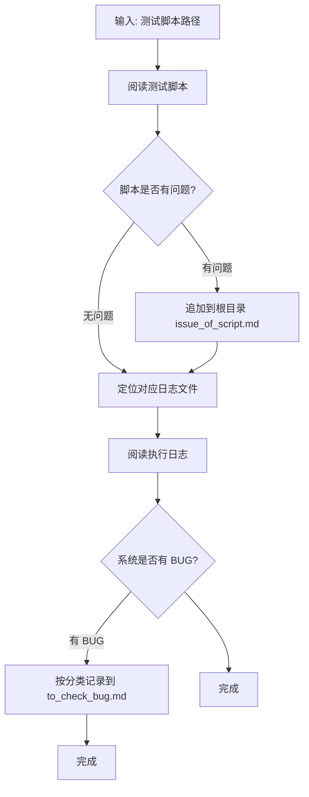

# LoranTest 脚本与 BUG 判定技能

## 1. 适用场景与流程

| 场景 | 说明 |
|------|------|
| 分析脚本是否有问题 | 阅读测试脚本，按脚本质量审查标准逐项检查，有问题则追加到根目录 `issue_of_script.md` |
| 分析系统是否有 BUG | 脚本无问题或已记录问题后，根据对应日志分析实际请求/响应与存储数据，按 BUG 判定标准判断并记录到用例同目录 `to_check_bug.md` |

**执行顺序**：先审脚本 → 再定位并阅读日志 → 再判 BUG。



---

## 2. 日志定位规则

### 2.1 日志文件命名约定

- **文件名前缀**：为**脚本文件名称**（去掉 `.py` 后的模块名），例如 `test_post_code_validation`。**不是**用例 ID（如 TC_C11）。
- **时间后缀**：格式为 `_{YYYYMMDD}_{HHMMSS}`，表示该次执行的**执行时间**。时间戳越新，表示执行时间越靠后。

同一脚本多次执行会生成多份日志，例如：

- `test_post_code_validation_20260307_221152.log`
- `test_post_code_validation_20260307_232224.log`

**分析时以「最后一份」为准**：按时间后缀排序后，取**时间最新**的那一份作为主要分析对象；此前执行的日志可作为辅助参考（如对比历史行为、排查偶现问题）。

### 2.2 脚本路径与日志路径的对应关系

日志目录 `logs/` 与用例目录 `cases/` 的层级一一对应，规则如下：

| 脚本路径 | 日志路径 |
|----------|----------|
| `cases/{P}/test_xxx.py` | `logs/{P}/test_xxx/test_xxx_{YYYYMMDD}_{HHMMSS}.log` |

其中 `{P}` 为 `cases` 之后的相对路径中的**目录部分**，`test_xxx` 为**脚本文件名称**（不含 `.py`）。每个脚本单独一个子目录，目录名与脚本文件名称相同，日志文件名 = 脚本文件名称 + 时间后缀 + `.log`。

**示例**：

| 脚本 | 日志目录 | 日志文件示例 |
|------|----------|--------------|
| `cases/.../test_post_management/test_post_basic_crud.py` | `logs/.../test_post_management/test_post_basic_crud/` | `test_post_basic_crud_20260307_221152.log` |

### 2.3 定位步骤

1. 从脚本绝对路径中提取 `cases` 之后的相对路径，得到 `rel = dirname + basename`（如 `test_ruoyi/.../test_post_management/test_post_basic_crud.py`）。
2. `log_dir = logs/ + os.path.dirname(rel) + "/" + 脚本文件名称（无扩展名）`。
3. 在 `log_dir` 下查找匹配 `{脚本文件名称}_*.log` 的文件。
4. 若存在多份日志，按文件名中的时间戳 `YYYYMMDD_HHMMSS` 排序，**取时间最新的一份**作为主要分析对象，此前日志作参考。

### 2.4 无日志时的处理

若对应目录下无任何 `.log` 文件，则仅做脚本审查，不进行系统 BUG 判定，并在结论中注明「未找到执行日志，未做系统 BUG 分析」。

---

## 3. 脚本质量审查标准

以下问题需记录到**项目根目录**的 `issue_of_script.md`，采用**追加**方式，不覆盖已有内容。

| 问题编号 | 问题类型 | 判定标准 | 建议修改方向 |
|----------|----------|----------|--------------|
| **ISS-1** | 模糊断言 | 使用 `check=[..., "in", [200, 500]]` 等骑墙断言，未明确业务预期（应成功或应失败） | 根据业务规则改为 `eq` 明确期望的 code，或改为对存储数据的断言 |
| **ISS-2** | 仅校验响应码 | 创建/修改类操作只断言 `$.code` 或 `$.msg`，未通过查询接口验证**实际存储**的字段值 | 增加 list/detail 查询 + 对 `$.data.xxx` 的断言，确保落库数据符合预期 |
| **ISS-3** | 数据清理缺失 | 测试中调用了创建资源的 Logic，但 teardown 中未清理；或未通过 fetch 将资源 ID 写入 register，导致 teardown 无法删除 | 为创建操作补充 fetch 将 ID 写入 `self.reg`，在 teardown_method 中根据 ID 调用删除类 Logic |
| **ISS-4** | 空测试方法 | 测试方法体为空，或仅包含 `self.reg.xxx = None`，无任何 Logic 调用或断言 | 补充实际测试步骤与断言，或标记为 skip/待实现 |
| **ISS-5** | 缺少 allure 标注 | 测试方法缺少 `@allure.title()` | 为每个 test 方法添加 `@allure.title("简短中文描述")` |
| **ISS-6** | 数据命名不规范 | 测试数据（如岗位名称、编码）未包含 case_id 或稳定可追溯前缀，数据残留时难以定位来源脚本 | 命名中纳入用例标识（如 `TC_C11_`、方法名片段）或时间戳，便于追溯与清理 |
| **ISS-7** | 前置数据依赖存量 | 测试依赖系统已有数据（如固定用户 ID、固定部门），未在脚本内自行创建所需数据 | 改为在 setup 或 test 内创建专用测试数据，保证用例独立可重复执行 |

审查时按上述 7 条逐项对照脚本内容，命中则记录到 `issue_of_script.md`。

---

## 4. 系统 BUG 判定标准

在**脚本无问题或已记录脚本问题**的前提下，结合**日志中的请求体、响应体、断言结果**判断被测系统是否存在 BUG。以下 7 个维度满足其一即可记为一条系统 BUG，并记录到**该用例所在目录**的 `to_check_bug.md`。

| 维度 | 名称 | 判定要点 | 典型表现（结合日志） |
|------|------|----------|----------------------|
| **1** | 输入校验缺陷 | 对非法或不合规输入未拒绝或未规范化 | 空值/超长/特殊字符/前后空格/换行符等传入后返回 200，且存储值与预期不符（如未 trim、未截断、未拒绝） |
| **2** | 数据完整性缺陷 | 落库数据与请求或业务约定不一致 | 详情接口返回的字段与创建/修改请求体不一致；应做转换的未转换（如前后空格未 trim、小数未取整） |
| **3** | 安全漏洞 | 接受危险输入且未转义或校验 | 接受 HTML 标签、XSS payload、SQL 注入片段等并原样入库，前端渲染存在存储型 XSS 或注入风险 |
| **4** | 业务规则违反 | 违反声明的业务规则或约束 | 唯一性约束失效、状态枚举未校验、权限控制缺失、级联/父子关系处理错误（如先删父后删子未拦截） |
| **5** | 错误处理缺陷 | 错误码、错误信息或异常处理不当 | 错误码与错误信息不匹配、提示不友好或缺失、应返回 4xx/5xx 却返回 200，或不应 500 却 500 |
| **6** | 用户体验缺陷 | 从终端用户视角不合理的行为 | 如编码大小写不区分、列表/分页结果错误、排序与约定不符等，导致使用困惑或数据展示错误 |
| **7** | 引用数据未同步 | 实体 A 被实体 B 通过 ID 引用，修改 A 的名称后，查询 B 时仍展示 A 的旧名称 | 修改被引用实体后查询引用方详情，日志中「真实响应体」里引用的名称字段仍为修改前的值 |

### 4.1 维度 7 详细说明：引用数据未同步（陈旧引用/缓存冗余）

**场景描述**：系统中存在实体间的引用关系（如「用户」引用了「岗位」、「角色」引用了「菜单」、「部门」引用了「上级部门」等）。B 实体通过 A 的 ID 关联 A。当 A 的名称/编码等展示性字段被修改后，通过 B 的查询接口查看 B 的详情或列表时，B 中引用 A 的字段应**展示 A 的最新值**，而非 A 被引用时的旧值。

**根本原因**：系统在 B 中**冗余存储了 A 的名称**（反范式设计），修改 A 时未同步更新 B 中的冗余字段；或系统使用了缓存，修改 A 后缓存未失效。

**判定方法**（结合日志）：

1. 日志中可观察到：先修改了 A 的名称（`mod_xxx` 请求体中 `name` 为新值，响应 200）。
2. 随后查询 B 的详情/列表（`lst_xxx_detail`），响应体中引用 A 的字段仍显示 A 的**旧名称**。
3. 脚本中对 B 的引用字段断言为 A 的新名称，断言失败。

**常见实例**：

| 被引用实体 A | 引用方 B | 引用字段 | 典型场景 |
|-------------|----------|----------|----------|
| 岗位 | 用户 | 用户详情中显示的岗位名称 | 修改岗位名称后，查看已绑定该岗位的用户详情 |
| 角色 | 用户 | 用户详情中显示的角色名称 | 修改角色名称后，查看已分配该角色的用户详情 |
| 部门 | 用户 | 用户详情中显示的部门名称 | 修改部门名称后，查看该部门下的用户详情 |
| 字典类型 | 字典数据 | 字典数据中显示的类型名称 | 修改字典类型名称后，查看其下的字典数据 |

判定时需结合**日志证据**：如「真实响应体」中的 code/data、断言失败时的「真实指定的响应对象」与「期望对象」对比、请求体与响应体字段对比等。

---

## 5. 日志分析要点

分析日志时优先关注以下内容，用于支撑「脚本问题」与「系统 BUG」的结论：

| 关注点 | 说明 | 常见日志关键字/格式 |
|--------|------|----------------------|
| 断言失败 | 业务层断言未通过，可能暴露系统行为与预期不符 | `pytest_check断言为False`、`compare_action`、`比较方式`、`期望对象`、`真实指定的响应对象` |
| 请求与响应 | 实际请求体与真实响应体，用于对比传入值与存储值 | `请求体json为`、`真实响应体`、`params为` |
| 错误级别 | 框架或业务记录的错误 | 日志级别 `[ERROR]` |
| 步骤边界 | 区分不同测试步骤，便于对应到具体用例与操作 | `开始/结束 ... 测试步骤`、`开始/结束 ... 请求` |
| 详情/列表数据 | 查询接口返回的 data/rows，用于校验存储是否与预期一致 | `真实响应体` 中的 `data`、`rows` 等 |

若日志中存在「断言为 False」且「期望对象」与「真实指定的响应对象」在业务上应一致（如期望 trim 后的编码、期望合法枚举），则倾向于判定为**系统 BUG**（数据完整性或输入校验等维度）。

---

## 6. 功能失效在脚本中的体现

当被测软件的**某个功能点失效**（未按业务预期工作）时，在脚本与日志上会有一系列可识别的特征。先归纳功能失效的常见原因，再对应到脚本侧的「错误特征」，便于区分是系统 BUG 还是脚本问题。

### 6.1 功能失效的可能原因（软件侧）

| 原因类型 | 说明 | 与第 4 节 BUG 维度的对应 |
|----------|------|---------------------------|
| 输入未校验或未规范化 | 该拒绝的未拒绝、该 trim 的未 trim、该截断的未截断、枚举值未校验 | 输入校验缺陷、业务规则违反 |
| 存储与请求不一致 | 落库数据与请求体或业务约定不一致，应做转换的未做（如空格未 trim、小数未取整） | 数据完整性缺陷 |
| 业务规则未落实 | 唯一性约束失效、状态机/权限/级联关系处理错误 | 业务规则违反 |
| 错误处理不当 | 该报错不报错、错误码或错误信息与约定不符、不应 500 却 500 | 错误处理缺陷 |
| 安全逻辑缺失 | 危险输入未转义或未拒绝，导致 XSS/注入等风险 | 安全漏洞 |
| 行为与用户预期不符 | 如编码大小写不区分、分页/排序结果错误 | 用户体验缺陷 |
| 引用数据陈旧 | A 被 B 通过 ID 引用，修改 A 名称后查 B 仍显示旧名称；系统冗余存储了引用名称却未同步更新，或缓存未失效 | 引用数据未同步 |

### 6.2 在脚本上的错误特征（如何体现功能失效）

- **脚本侧前提**：脚本对「正确业务预期」做了**明确、合理的断言**（例如：存储的 `postCode` 应为 trim 后的值；`status` 应在 `["0","1"]` 内）。
- **功能正常时**：系统行为符合该预期 → 断言通过，日志无业务层断言失败。
- **功能失效时**：系统行为不符合该预期 → **该断言失败**。

**日志中的典型特征**：

| 现象 | 含义 |
|------|------|
| `pytest_check断言为False` | 业务层 check 未通过 |
| `比较方式为 equal`（或其它） + `期望对象` / `真实指定的响应对象` | 期望值 = 正确业务结果，实际值 = 系统给出的错误结果；对比二者可判断是存储错误、未 trim、枚举错误等 |
| 请求体与「真实响应体」中 data 的字段不一致 | 传入值与落库值不一致，属数据完整性或输入规范化问题 |

**若脚本未对存储数据做断言**（只断言了 `$.code == 200`）：功能失效可能**不会**在脚本中体现，测试仍通过，只能通过人工查日志或手工验证发现。这正是 ISS-2「仅校验响应码」导致的问题。

**判定时的使用方式**：

- 断言失败 + **期望值符合业务规则** + 实际值为系统返回/存储的错误结果 → 倾向判定为**系统 BUG**（按第 4 节维度归类）。
- 断言失败 + 期望值本身不合理或与业务约定不符 → 可能是**脚本错误**（如断言写错），需结合脚本审查标准（第 3 节）记录到 `issue_of_script.md`。

---

## 7. BUG 记录格式（to_check_bug.md）

系统 BUG 追加记录在根目录的 `to_check_bug.md` 中（若不存在则新建）。每条 BUG 建议包含以下字段，并按**严重级别**与**BUG 类型**在文档中分类或标注。

### 7.1 单条 BUG 模板

```markdown
## BUG-{序号}: {简短标题} 【已确认/待确认】

- **关联用例**: {用例编号或 test 方法名}
- **复现步骤**: {操作步骤简述}
- **实际结果**: {系统实际行为，可引用日志中的请求/响应关键内容}
- **预期结果**: {按业务规则应有的正确行为}
- **影响**: {对功能、安全、数据、用户体验的影响}
- **严重级别**: 高 / 中 / 低
- **BUG 类型**: 输入校验 / 数据完整性 / 安全漏洞 / 业务规则 / 错误处理 / 用户体验 / 引用数据未同步
- **脚本断言**: {若由脚本断言失败发现，可写断言表达式或检查方式}
- **确认时间**: {YYYY-MM-DD，若已人工确认}
- **确认证据**: {日志片段、响应体片段等}
```

### 7.2 严重级别与 BUG 类型

| 严重级别 | 适用情况 |
|----------|----------|
| 高 | 安全漏洞（如 XSS）、数据严重不一致、核心业务规则破坏 |
| 中 | 输入未校验/未 trim、枚举未校验、唯一性等问题，影响正确性或可维护性 |
| 低 | 边界行为、体验问题、约定不一致但可规避 |

BUG 类型与第 4 节 7 个维度一致：**输入校验**、**数据完整性**、**安全漏洞**、**业务规则**、**错误处理**、**用户体验**、**引用数据未同步**。

---

## 8. 脚本问题记录格式（issue_of_script.md）

脚本问题记录在**项目根目录**的 `issue_of_script.md` 中，采用**追加**方式写入，不覆盖已有内容。

### 8.1 单条记录模板

```markdown
### {脚本相对路径，如 cases/test_ruoyi/.../test_post_code_validation.py}

- **问题类型**: ISS-{编号} {类型名称}
- **具体描述**: {脚本中具体位置与问题描述}
- **建议修改**: {简要修改建议}
- **发现时间**: {YYYY-MM-DD}
---
```

### 8.2 问题类型编号

与第 3 节一致：ISS-1 模糊断言、ISS-2 仅校验响应码、ISS-3 数据清理缺失、ISS-4 空测试方法、ISS-5 缺少 allure 标注、ISS-6 数据命名不规范、ISS-7 前置数据依赖存量。

---

## 9. 执行检查清单

进行「脚本 + 日志 → BUG 判定」时，可按以下顺序执行：

- [ ] 读取并解析目标测试脚本（类、方法、Logic 调用、check/fetch、teardown、数据命名）。
- [ ] 按 7 条脚本质量审查标准逐项检查，命中则追加到根目录 `issue_of_script.md`。
- [ ] 根据脚本路径按 2.1～2.3 节规则定位日志目录，按时间后缀取**最后一份（最新）**日志进行分析；若无日志则注明并结束系统 BUG 分析。
- [ ] 阅读日志，关注 5 节的关注点，提取请求体、响应体、断言失败信息。
- [ ] 按 7 个 BUG 维度（含引用数据未同步）判断是否存在系统 BUG；若有，按 7.1 模板写入用例目录的 `to_check_bug.md`，并标注严重级别与 BUG 类型。
- [ ] 结论汇总：脚本问题条数及类型、是否分析日志、系统 BUG 条数及类型。
