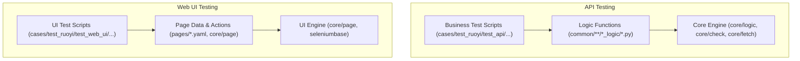

# LoranTest - Declarative Python API & Web UI Test Automation Framework

[](https://www.python.org/)
[](https://docs.pytest.org/)
[](https://docs.qameta.io/allure/)
[](https://github.com/WaterLoran/LoranTest/stargazers)
[](https://github.com/WaterLoran/LoranTest/network/members)

LoranTest is a **declarative Python test automation framework** for **API testing** and **Web UI testing**, designed by a former Huawei test-development engineer.  
It combines **AOP (aspect‑oriented programming)**, **three‑layer decoupled architecture**, and **pytest** to let you write robust tests with **minimal boilerplate**, **rich logging**, **JSONPath assertions**, **data extraction**, **automatic cleanup**, **retry**, and **Excel/MySQL plugins**.

- **English** · You are here  
- **中文请见下方** → [中文文档 (Chinese)](#中文文档-chinese)

> Suggested GitHub topics for better discovery: `python`, `pytest`, `test-automation`, `api-testing`, `ui-automation`, `selenium`, `allure`, `jsonpath`, `aop`, `framework`.

---

## Highlights (Why LoranTest)

- **AOP‑based declarative syntax**: describe **what** the API/page does, not **how** to call `requests` or Selenium – the framework handles the wiring.
- **Three‑layer decoupled architecture**: business test script, framework core, and data description (API/page) are fully separated → low coupling, easy maintenance.
- **Zero‑boilerplate API encapsulation**: define an API Logic with **only** `req_method`, `req_url`, `req_json`/`req_params` and decorators like `@Api.json`.
- **Powerful test orchestration**: built‑in `check`, `fetch`, `retry`, `restore`, `context`, `timeout`, file download, Excel assertion, MySQL utilities.
- **Enterprise‑grade logging & Allure reporting**: per‑test log files automatically organized by case path + Allure steps for every Logic call.
- **Ultra‑low learning curve**: interns without Python background can write real API and UI tests in hours by composing Logic functions.

---

## Architecture Overview

LoranTest separates **business scenarios**, **framework engine**, and **data description** for both API and Web UI:



**Key ideas:**

- **Business scripts** only call Logic functions / Page actions in a readable, pytest‑style manner.
- **Logic layer** describes API endpoints or page nodes declaratively (URL, method, body schema, JSONPath mapping).
- **Core engine** (AOP) intercepts calls and injects logging, requests, assertions, extraction, retry, and teardown.

---

## Quick Start

### 1. Prerequisites

- Python **3.8+**
- `git`, `pip`, and a modern browser (for Web UI tests)
- Docker (optional but recommended for one‑command RuoYi test environment)

### 2. Clone & install

```bash
git clone https://github.com/WaterLoran/LoranTest.git
cd LoranTest
python -m venv .venv
source .venv/bin/activate  # Windows: .venv\Scripts\activate
pip install -r requirements.txt
```

### 3. Start the demo RuoYi system (Docker)

```bash
docker run -d -p 6161:80 -v ruoyi_data:/app/data \
  --name ruoyi --restart unless-stopped \
  waterloran/ruoyi-for-lorantest:latest
```

RuoYi upstream repository: `https://github.com/WaterLoran/RuoYi`

### 4. Configure environment

Adjust `config/environment.yaml`, `config/database.yaml`, and `config/user.yaml` to match your local environment and RuoYi instance:

- Base URLs for API and Web UI
- Database connection (for MySQL plugin)
- Test users / roles

### 5. Run API tests

Using the provided entry script:

```bash
python run_api_case.py -k test_example -d cases/test_ruoyi/test_example
```

Or directly with pytest:

```bash
pytest cases/test_ruoyi/test_example -s
```

Allure results will be generated (see script/config) and logs will appear under `logs/` mirroring the `cases/` tree.

### 6. Run Web UI tests

```bash
pytest cases/test_ruoyi/test_web_ui -s
```

The framework uses **SeleniumBase**, so you do not need to manage drivers or explicit waits – it is all handled for you.

---

## Core Concepts (API Testing)

### Logic function – declarative API encapsulation

A Logic function is a Python function decorated by `@Api.json` / `@Api.urlencoded` / `@Api.form_data` that describes **one HTTP API**:

```python
from core.logic import *

@Api.json
@allure.step("Add application")
def add_application(name="", url="", description="", parentId=None, **kwargs):
    req_method = "POST"
    req_url = "dev-api/it-systems/save"
    req_json = {
        "name": "",
        "url": "http://baidu.com",
        "description": "应用说明",
        "parentId": 0,
    }
    rsp_check = {
        "code": "SUCCESS",
        "data": {
            "name": "$.name",
            "type": "IT_SYSTEM",
        },
    }
    restore = {
        "rmv_application": {
            "ids": ["$.data.id", "to_list"]
        }
    }
    return locals()
```

You only describe the **shape** of the request/response. The framework:

- fills parameters automatically into `req_json`/`req_params`
- sends the HTTP request
- performs `rsp_check` API‑level assertions
- records restore info for automatic cleanup

### Test script – readable business scenarios

Business test scripts live under `cases/` and import project Logic via `common/ruoyi_logic.py`:

```python
# coding: utf-8
from common.ruoyi_logic import *


class TestAddUser001(object):
    def setup_method(self):
        self.reg = register({"user_id": None})

    @allure.title("Add user and verify basic info")
    def test_add_user_001(self):
        ts = int(time.time())
        username = f"auto_user_{ts}"

        add_user(
            userName=username,
            nickName=f"Nick_{ts}",
            fetch=[self.reg, "user_id", "$.userId"],
            check=["$.code", "eq", 200],
            restore=True,
        )

        lst_user_detail(
            userId=self.reg.user_id,
            check=[
                ["$.data.userName", "eq", username],
                ["$.data.userId", "eq", self.reg.user_id],
            ],
        )

    def teardown_method(self):
        # restore=True will auto‑clean if Logic defines restore
        pass
```

### `register`, `check`, `fetch`, `restore`, `retry`

- **`register()`**: a dict‑like object to store IDs and data across steps.
- **`check`**: JSONPath‑based assertions, e.g.:

  ```python
  check=[
      ["$.code", "eq", 200],
      ["$.data.name", "eq", "架构A"],
      ["$.rows[?(@.userName==username)]", "exist", True],
  ]
  ```

- **`fetch`**: extract data from responses into `register`:

  ```python
  fetch=[self.reg, "architecture_id", "$.data.id"]
  ```

- **`restore=True`**: when the Logic defines a `restore` block, test teardown will automatically call delete APIs with right IDs.
- **`retry`**: polling for eventual consistency (publish, async jobs, ES index, etc.):

  ```python
  lst_latest_released_architecture(
      check=[f"$.data[?(@.link.name=='{var_name}')]", "exist", True],
      retry=60,
  )
  ```

---

## Web UI Automation with SeleniumBase

For Web UI, LoranTest uses a **page data + engine** model:

- Page metadata (locators, default actions) is defined under `pages/`.
- `core/page` interprets page data and forwards actions to SeleniumBase.
- Test scripts in `cases/test_ruoyi/test_web_ui` call high‑level page actions instead of raw Selenium.

Typical Web UI test structure:

```python
from pages import *
from core.page import ui_init
from seleniumbase import BaseCase


class TestLoginRuoyi(BaseCase):
    def setUp(self):
        super().setUp()
        ui_init(self)  # inject SeleniumBase instance into LoranTest UI engine

    def test_login(self):
        login_page_open()
        login_page_input_username("admin")
        login_page_input_password("admin123")
        login_page_click_login()
        login_page_assert_login_success()
```

You get:

- zero driver management
- built‑in waits
- concise, readable actions

---

## Feature Matrix

| Category        | Feature                                                |
|----------------|--------------------------------------------------------|
| Core           | Per‑case logging (console + file, path‑aware)         |
|                | Allure step integration                               |
|                | YAML‑driven configuration (`config/*.yaml`)           |
|                | JSONPath‑based assertions (`check`)                   |
|                | JSONPath‑based data extraction (`fetch`)              |
|                | Automatic cleanup via `restore`                       |
|                | Retry for async operations (`retry`)                  |
| API Testing    | `@Api.json`, `@Api.urlencoded`, `@Api.form_data`      |
|                | Request/response mapping via `req_field` / `rsp_field`|
|                | Context merge (`context`) for partial updates         |
|                | File download & binary response handling              |
| UI Testing     | SeleniumBase integration                              |
|                | Page object with declarative locators & actions       |
|                | Visibility / clickability / text assertions           |
| Extensions     | Excel assertion utilities                             |
|                | MySQL helper functions                                |
| Tooling        | `run_api_case.py` pytest entry                        |
|                | Project‑wide logging hooks in `core/hook.py`          |

---

## Project Structure

```text
LoranTest/
├── cases/                  # Test scripts (API & Web UI)
│   └── test_ruoyi/
│       ├── test_api/
│       ├── test_example/   # Framework usage examples
│       └── test_web_ui/
├── common/                 # Logic (API) encapsulation, per business module
├── config/                 # environment.yaml, database.yaml, user.yaml
├── core/                   # Framework core (logic engine, page engine, hooks)
│   ├── logic/              # Api decorators, request/response handling, retry
│   ├── page/               # Web UI engine based on SeleniumBase
│   ├── check.py            # Assertion system
│   ├── fetch.py            # Data extraction
│   └── hook.py             # Pytest hooks, logging, restore
├── files/                  # Static files used in tests
├── logs/                   # Test run logs (mirror of cases/ tree)
├── pages/                  # Page object data for Web UI tests
├── requirements.txt        # Python dependencies
├── run_api_case.py         # CLI entry for running API tests
└── README.md
```

---

## Tech Stack

- **Language**: Python
- **Test runner**: pytest
- **Reporting**: Allure
- **HTTP client**: requests
- **UI automation**: SeleniumBase (Selenium)
- **Data handling**: jsonpath, PyYAML, pandas, openpyxl
- **Database**: PyMySQL

---

## Community & Learning

- Bilibili: 搜索 “罗兰水” 查看 **若依测试框架上手视频** 和实战讲解  
  - 入门视频示例：`https://www.bilibili.com/video/BV1ZJ4m1E77S/`
- Demo system: `waterloran/ruoyi-for-lorantest:latest` (see Docker command above)
- WeChat: add `13538302392` with remark **“RuoyiTest”** to join the study group.

---

## 中文文档 (Chinese)

### 项目简介

LoranTest 是一款由 **前华为测试开发工程师** 设计的 **Python 自动化测试框架**，同时支持 **接口自动化** 和 **Web UI 自动化**。  
框架充分借鉴了 HttpRunner 和华为内部测试平台的优秀实践，结合 **AOP 面向切面编程** 思想，提供了一套 **描述式的 Python 语法**，让测试工程师可以用极少的代码完成复杂的业务场景自动化。

主要特点：

- **语法直观、易读易维护**：测试脚本贴近业务描述，新人上手极快。
- **数据与逻辑高度解耦**：接口描述写在 Logic，业务场景写在 cases，互不污染。
- **核心功能齐全**：日志、报告、断言、提取、重试、自动清理一应俱全。
- **扩展能力强**：内置 MySQL 操作、Excel 断言、批量执行入口，易于二次开发。

---

### 核心优势

- **三层解耦架构**
  - 接口测试：业务脚本层（cases） / 框架逻辑层（core） / 接口数据描述层（common Logic）
  - Web UI：业务脚本层（cases） / 框架逻辑层（core/page） / Page 数据描述层（pages）
- **基于装饰器的切面编程**
  - 用 `@Api.json` / `@Api.urlencoded` / `@Api.form_data` 描述接口
  - 日志、请求发送、断言、提取、重试、自动清理等通用逻辑全部放在装饰器和核心引擎中统一处理
- **对新人极度友好**
  - 实习生在 **没有 Python 基础** 的前提下，也可以快速学会编写接口关键字、接口脚本以及 Web UI 的 page 和脚本

---

### 快速开始（中文）

1. **克隆仓库并安装依赖**

   ```bash
   git clone https://github.com/WaterLoran/LoranTest.git
   cd LoranTest
   python -m venv .venv
   source .venv/bin/activate  # Windows 使用 .venv\Scripts\activate
   pip install -r requirements.txt
   ```

2. **启动若依示例系统（Docker 一键部署）**

   ```bash
   docker run -d -p 6161:80 -v ruoyi_data:/app/data \
     --name ruoyi --restart unless-stopped \
     waterloran/ruoyi-for-lorantest:latest
   ```

3. **修改配置**

   - 在 `config/environment.yaml` 中配置接口及前端地址
   - 在 `config/user.yaml` 中配置测试账号等冷数据
   - 如需使用数据库能力，修改 `config/database.yaml`

4. **运行示例用例**

   ```bash
   python run_api_case.py -k test_example -d cases/test_ruoyi/test_example
   # 或
   pytest cases/test_ruoyi/test_example -s
   ```

5. **查看日志与报告**

   - 日志：`logs/` 目录，目录结构与 `cases/` 一一对应，按脚本名与时间自动归档。
   - 报告：支持生成 Allure 报告，可在 CI/CD 中集成展示。

---

### 核心概念（接口自动化）

- **Logic 封装（位于 `common/`）**
  - 每个 Logic 函数对应一个后端接口，只需要描述 URL、请求方法、请求体默认结构以及必要的 rsp_check/restore 映射。
  - 使用 `from core.logic import *` 引入 `Api`、`register`、`config` 等核心对象。
- **测试脚本（位于 `cases/`）**
  - 使用 `from common.ruoyi_logic import *` 统一引入项目的全部 Logic。
  - 通过 `register` 存储 ID，结合 `check`、`fetch`、`restore`、`retry` 等能力，编排复杂业务场景。
- **自动清理（restore 机制）**
  - 在 Logic 中配置 `restore`，在调用侧传入 `restore=True`，框架会在测试结束后自动调用删除类接口，避免脏数据。

---

### Web UI 自动化部分

- 使用 **SeleniumBase** 作为浏览器自动化引擎，无需关心浏览器驱动与显隐性等待问题。
- Page 层只需描述元素定位和默认操作，代码量极少；业务脚本层通过函数调用完成流程编排。
- 典型适用场景：
  - 后台管理系统的功能回归
  - 表单校验、导航跳转、基础展示类测试

---

### 目录说明（简要）

- `cases/`：自动化用例目录（接口 + Web UI）
- `common/`：接口 Logic 封装，按业务模块划分子目录
- `config/`：环境、数据库、账号等配置
- `core/`：框架核心（请求引擎、断言、日志、钩子、UI 引擎）
- `files/`：测试需要的静态文件（上传/下载用）
- `logs/`：执行日志，自动按脚本归档
- `pages/`：Web UI 的 Page 描述

---

### 学习与交流

- B 站：搜索 **“罗兰水”**，有完整的 **若依测试框架上手视频** 与实战讲解。
- 微信：添加 `13538302392` 并备注 **“RuoyiTest”**，可加入技术交流群一起交流测试框架设计与实践。

如果你正在寻找一套 **工程化程度高、可读性强、又方便团队推广的 Python 自动化测试框架**，欢迎 Star & Fork LoranTest，一起把它打磨成下一代开源测试框架的标杆。

