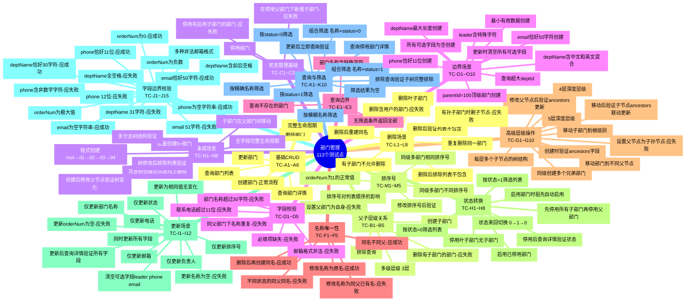

# 部门管理测试点 (113个)

## 测试点脑图

## 测试点分类统计

| 分类 | 编号范围 | 数量 | 描述 |
|------|----------|------|------|
| 基础CRUD | TC-A1~A6 | 6 | 增删改查基本流程 |
| 父子层级 | TC-B1~B5 | 5 | 父子关系、层级结构 |
| 状态管理基础 | TC-C1~C3 | 3 | 状态基本操作 |
| 字段校验 | TC-D1~D5 | 5 | 基础字段验证 |
| 查询边界 | TC-E1~E3 | 3 | 查询边界情况 |
| 名称唯一性 | TC-F1~F5 | 5 | 名称重复校验的各种场景 |
| 高级层级操作 | TC-G1~G10 | 10 | 深层级、移动、祖先路径 |
| 状态转换 | TC-H1~H8 | 8 | 状态切换和联动 |
| 更新场景 | TC-I1~I12 | 12 | 各字段独立/组合更新 |
| 字段边界校验 | TC-J1~J15 | 15 | 字段长度、格式极端值 |
| 查询与筛选 | TC-K1~K10 | 10 | 列表筛选组合 |
| 删除场景 | TC-L1~L8 | 8 | 删除约束和级联 |
| 排序号 | TC-M1~M5 | 5 | 排序号相关测试 |
| 集成场景 | TC-N1~N8 | 8 | 多步骤复杂业务流 |
| 边界场景 | TC-O1~O10 | 10 | 极端边界值 |
| **合计** | | **113** | |

## 测试流程图

```mermaid
flowchart TD
    subgraph 创建流程
        C1[POST /system/dept] --> C2{deptName非空?}
        C2 -->|No| C3[返回错误: 必填项缺失]
        C2 -->|Yes| C4{deptName<=30字符?}
        C4 -->|No| C5[返回错误: 长度超限]
        C4 -->|Yes| C6{同父下名称唯一?}
        C6 -->|No| C7[返回错误: 名称已存在]
        C6 -->|Yes| C8{父部门状态正常?}
        C8 -->|No| C9[返回错误: 部门停用不允许新增]
        C8 -->|Yes| C10{phone<=11位?}
        C10 -->|No| C11[返回错误: 手机号长度超限]
        C10 -->|Yes| C12{email格式合法?}
        C12 -->|No| C13[返回错误: 邮箱格式错误]
        C12 -->|Yes| C14[创建成功<br/>设置ancestors=parent.ancestors+parentId]
    end

    subgraph 更新流程
        U1[PUT /system/dept] --> U2{parentId != deptId?}
        U2 -->|No| U3[返回错误: 上级部门不能是自己]
        U2 -->|Yes| U4{同父下名称唯一?}
        U4 -->|No| U5[返回错误: 名称已存在]
        U4 -->|Yes| U6{status=1且有正常子部门?}
        U6 -->|Yes| U7[返回错误: 包含未停用的子部门]
        U6 -->|No| U8[更新成功]
        U8 --> U9{parentId变更?}
        U9 -->|Yes| U10[递归更新所有子孙ancestors]
        U9 -->|No| U11[完成]
        U8 --> U12{status变为0?}
        U12 -->|Yes| U13[所有祖先设为正常]
    end

    subgraph 删除流程
        D1[DELETE /system/dept/deptId] --> D2{存在子部门?}
        D2 -->|Yes| D3[返回警告601: 存在下级部门不允许删除]
        D2 -->|No| D4{部门下有用户?}
        D4 -->|Yes| D5[返回警告601: 部门存在用户不允许删除]
        D4 -->|No| D6[软删除: del_flag=2]
    end
```

