# 字典管理测试点（≥100 条）

## 1. 测试点总览（Mermaid Mindmap）

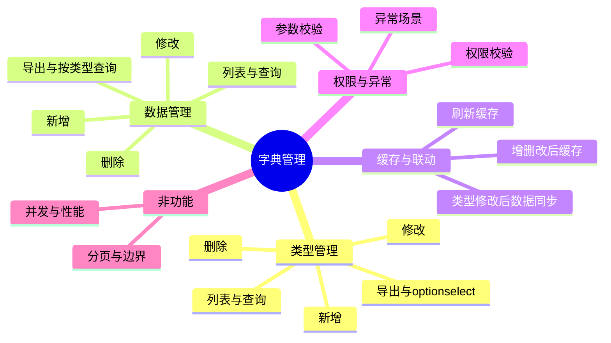

## 2. 字典类型 - 列表与查询（TP-T01 ~ TP-T18）

```mermaid
flowchart LR
  subgraph list [列表与查询]
    TP_T01[TP-T01 无参分页列表]
    TP_T02[TP-T02 按dictName模糊]
    TP_T03[TP-T03 按dictType精确]
    TP_T04[TP-T04 status=0]
    TP_T05[TP-T05 status=1]
    TP_T06[TP-T06 日期范围]
    TP_T07[TP-T07 pageSize边界]
    TP_T08[TP-T08 pageNum越界]
    TP_T09[TP-T09 空结果]
    TP_T10[TP-T10 单条结果]
    TP_T11[TP-T11 多条件组合]
    TP_T12[TP-T12 排序一致性]
    TP_T13[TP-T13 total与rows长度]
    TP_T14[TP-T14 响应结构完整性]
    TP_T15[TP-T15 中文dictName]
    TP_T16[TP-T16 特殊字符dictType]
    TP_T17[TP-T17 超长dictName]
    TP_T18[TP-T18 空字符串条件]
  end
```

| 编号 | 测试点名称 |
|------|------------|
| TP-T01 | 字典类型-无筛选条件分页列表，默认 pageNum=1、pageSize=10 |
| TP-T02 | 字典类型-按字典名称 dictName 模糊查询 |
| TP-T03 | 字典类型-按字典类型 dictType 精确查询 |
| TP-T04 | 字典类型-按状态 status=0（正常）筛选 |
| TP-T05 | 字典类型-按状态 status=1（停用）筛选 |
| TP-T06 | 字典类型-按创建时间/更新时间范围筛选 |
| TP-T07 | 字典类型-分页参数 pageSize 边界值（1、10、100、系统最大） |
| TP-T08 | 字典类型-分页参数 pageNum 越界（0、负数、超大） |
| TP-T09 | 字典类型-查询条件无匹配时返回空列表 |
| TP-T10 | 字典类型-查询条件匹配单条时 rows 仅一条 |
| TP-T11 | 字典类型-多条件组合筛选（名称+类型+状态+时间） |
| TP-T12 | 字典类型-列表排序与数据库/业务约定一致 |
| TP-T13 | 字典类型-分页 total 与 rows 长度关系正确 |
| TP-T14 | 字典类型-列表响应结构含 code、msg、rows、total |
| TP-T15 | 字典类型-按中文字典名称查询 |
| TP-T16 | 字典类型-按含下划线/数字的 dictType 查询 |
| TP-T17 | 字典类型-按超长 dictName 条件查询（边界 100 字符） |
| TP-T18 | 字典类型-条件传空字符串时的行为 |

## 3. 字典类型 - 新增（TP-T19 ~ TP-T33）

```mermaid
flowchart LR
  subgraph add [新增]
    TP_T19[TP-T19 必填新增]
    TP_T20[TP-T20 全字段新增]
    TP_T21[TP-T21 dictType唯一]
    TP_T22[TP-T22 dictType格式]
    TP_T23[TP-T23 dictName超长]
    TP_T24[TP-T24 status 0/1]
    TP_T25[TP-T25 remark]
    TP_T26[TP-T26 dictName空]
    TP_T27[TP-T27 dictType空]
    TP_T28[TP-T28 dictType大写]
    TP_T29[TP-T29 dictType特殊字符]
    TP_T30[TP-T30 重复dictType]
    TP_T31[TP-T31 响应返回dictId]
    TP_T32[TP-T32 新增后列表可见]
    TP_T33[TP-T33 新增后缓存]
  end
```

| 编号 | 测试点名称 |
|------|------------|
| TP-T19 | 字典类型-新增仅必填（dictName、dictType） |
| TP-T20 | 字典类型-新增全字段（dictName、dictType、status、remark） |
| TP-T21 | 字典类型-新增时 dictType 全局唯一校验 |
| TP-T22 | 字典类型-dictType 格式：小写字母开头、仅小写字母数字下划线 |
| TP-T23 | 字典类型-dictName、dictType 长度不超过 100 字符 |
| TP-T24 | 字典类型-新增 status=0 与 status=1 |
| TP-T25 | 字典类型-新增带备注 remark |
| TP-T26 | 字典类型- dictName 为空时返回校验错误 |
| TP-T27 | 字典类型-dictType 为空时返回校验错误 |
| TP-T28 | 字典类型-dictType 含大写字母时返回格式错误 |
| TP-T29 | 字典类型-dictType 含特殊字符时返回格式错误 |
| TP-T30 | 字典类型-重复 dictType 新增失败并提示 |
| TP-T31 | 字典类型-新增成功响应含 dictId 或可定位记录 |
| TP-T32 | 字典类型-新增后列表接口可查到该条 |
| TP-T33 | 字典类型-新增后该类型缓存被设置（空或占位） |

## 4. 字典类型 - 修改（TP-T34 ~ TP-T47）

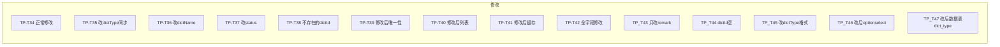

| 编号 | 测试点名称 |
|------|------------|
| TP-T34 | 字典类型-正常修改（dictId、dictName、dictType、status、remark） |
| TP-T35 | 字典类型-修改 dictType 后 sys_dict_data 中该类型数据同步为新 type |
| TP-T36 | 字典类型-仅修改 dictName |
| TP-T37 | 字典类型-仅修改 status（0/1 切换） |
| TP-T38 | 字典类型-修改不存在的 dictId 返回错误 |
| TP-T39 | 字典类型-修改后 dictType 与其他类型不重复 |
| TP-T40 | 字典类型-修改后列表接口返回新值 |
| TP-T41 | 字典类型-修改后对应缓存刷新 |
| TP-T42 | 字典类型-全字段修改 |
| TP-T43 | 字典类型-仅修改 remark |
| TP-T44 | 字典类型-修改时 dictId 为空或缺失返回错误 |
| TP-T45 | 字典类型-修改 dictType 不符合格式时返回错误 |
| TP-T46 | 字典类型-修改后 optionselect 返回新类型名 |
| TP-T47 | 字典类型-修改 dictType 后数据表 dict_type 字段更新 |

## 5. 字典类型 - 删除（TP-T48 ~ TP-T57）

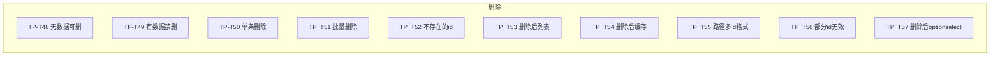

| 编号 | 测试点名称 |
|------|------------|
| TP-T48 | 字典类型-无字典数据的类型可删除 |
| TP-T49 | 字典类型-存在字典数据的类型禁止删除并提示 |
| TP-T50 | 字典类型-单条删除（路径单 id） |
| TP-T51 | 字典类型-批量删除（路径多 id 逗号分隔） |
| TP-T52 | 字典类型-删除不存在的 dictId 的行为 |
| TP-T53 | 字典类型-删除后列表不再包含该条 |
| TP-T54 | 字典类型-删除后该类型缓存移除 |
| TP-T55 | 字典类型-删除路径参数多 id 格式正确（如 1,2,3） |
| TP-T56 | 字典类型-批量删除中部分 id 不存在时的行为 |
| TP-T57 | 字典类型-删除后 optionselect 不包含该类型 |

## 6. 字典类型 - 导出与 optionselect（TP-T58 ~ TP-T63）

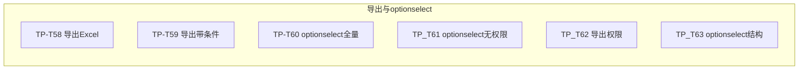

| 编号 | 测试点名称 |
|------|------------|
| TP-T58 | 字典类型-导出接口返回 Excel 文件或流 |
| TP-T59 | 字典类型-导出支持与列表相同的筛选条件 |
| TP-T60 | 字典类型-optionselect 返回全部类型列表 |
| TP-T61 | 字典类型-optionselect 无需 list 权限可访问 |
| TP-T62 | 字典类型-导出需要 export 权限 |
| TP-T63 | 字典类型-optionselect 响应结构为数组含 dictId、dictName、dictType 等 |

## 7. 字典数据 - 列表与查询（TP-D01 ~ TP-D12）

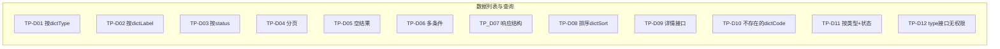

| 编号 | 测试点名称 |
|------|------------|
| TP-D01 | 字典数据-列表按 dictType 筛选 |
| TP-D02 | 字典数据-列表按 dictLabel 模糊 |
| TP-D03 | 字典数据-列表按 status 筛选 |
| TP-D04 | 字典数据-分页参数生效 |
| TP-D05 | 字典数据-无匹配时空列表 |
| TP-D06 | 字典数据-多条件组合查询 |
| TP-D07 | 字典数据-列表响应含 rows、total、code |
| TP-D08 | 字典数据-列表按 dictSort 排序 |
| TP-D09 | 字典数据-详情接口按 dictCode 查询单条 |
| TP-D10 | 字典数据-详情查询不存在的 dictCode |
| TP-D11 | 字典数据-按 dictType 与 status 组合 |
| TP-D12 | 字典数据-按类型查数据接口 /type/{dictType} 可无 list 权限 |

## 8. 字典数据 - 新增（TP-D13 ~ TP-D24）

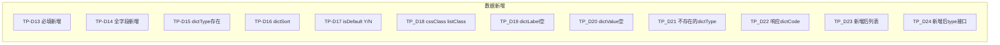

| 编号 | 测试点名称 |
|------|------------|
| TP-D13 | 字典数据-新增仅必填（dictLabel、dictValue、dictType） |
| TP-D14 | 字典数据-新增全字段（含 dictSort、cssClass、listClass、isDefault、status、remark） |
| TP-D15 | 字典数据-新增时 dictType 必须为已存在的类型 |
| TP-D16 | 字典数据-新增 dictSort 决定展示顺序 |
| TP-D17 | 字典数据-新增 isDefault 为 Y 或 N |
| TP-D18 | 字典数据-新增 cssClass、listClass 长度与内容 |
| TP-D19 | 字典数据-dictLabel 为空时校验失败 |
| TP-D20 | 字典数据-dictValue 为空时校验失败 |
| TP-D21 | 字典数据-不存在的 dictType 新增失败或提示 |
| TP-D22 | 字典数据-新增成功响应含 dictCode |
| TP-D23 | 字典数据-新增后列表可查到 |
| TP-D24 | 字典数据-新增后 /type/{dictType} 返回该条（含缓存） |

## 9. 字典数据 - 修改与删除（TP-D25 ~ TP-D36）

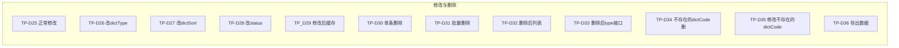

| 编号 | 测试点名称 |
|------|------------|
| TP-D25 | 字典数据-正常修改（dictCode、dictLabel、dictValue、dictType、dictSort、status 等） |
| TP-D26 | 字典数据-修改 dictType 到另一已存在类型 |
| TP-D27 | 字典数据-修改 dictSort 后排序变化 |
| TP-D28 | 字典数据-修改 status 0/1 |
| TP-D29 | 字典数据-修改后该类型缓存刷新 |
| TP-D30 | 字典数据-单条删除 |
| TP-D31 | 字典数据-批量删除（路径多 dictCode） |
| TP-D32 | 字典数据-删除后列表不再包含 |
| TP-D33 | 字典数据-删除后 /type/{dictType} 不返回该条 |
| TP-D34 | 字典数据-删除不存在的 dictCode 的行为 |
| TP-D35 | 字典数据-修改不存在的 dictCode 返回错误 |
| TP-D36 | 字典数据-导出接口返回 Excel 或流 |

## 10. 缓存与联动（TP-C01 ~ TP-C08）

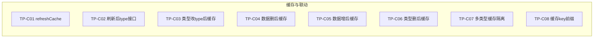

| 编号 | 测试点名称 |
|------|------------|
| TP-C01 | 刷新字典缓存接口 refreshCache 调用成功 |
| TP-C02 | 刷新缓存后 /type/{dictType} 返回与数据库一致 |
| TP-C03 | 类型修改 dictType 后，该类型缓存与数据表一致 |
| TP-C04 | 字典数据删除后，该类型缓存更新 |
| TP-C05 | 字典数据新增后，该类型缓存包含新数据 |
| TP-C06 | 类型删除后，该类型缓存移除 |
| TP-C07 | 多类型之间缓存互不干扰 |
| TP-C08 | 缓存 key 使用约定前缀（如 sys_dict:） |

## 11. 权限与异常（TP-E01 ~ TP-E12）

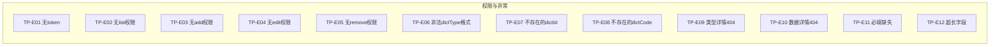

| 编号 | 测试点名称 |
|------|------------|
| TP-E01 | 未携带 token 或 token 无效时接口返回 401 |
| TP-E02 | 无 system:dict:list 权限时列表/导出不可用 |
| TP-E03 | 无 system:dict:add 权限时新增不可用 |
| TP-E04 | 无 system:dict:edit 权限时修改不可用 |
| TP-E05 | 无 system:dict:remove 权限时删除/refreshCache 不可用 |
| TP-E06 | dictType 非法格式（如大写、特殊字符）返回 400/500 或明确错误 |
| TP-E07 | 类型详情/修改/删除使用不存在的 dictId |
| TP-E08 | 数据详情/修改/删除使用不存在的 dictCode |
| TP-E09 | 类型详情 GET /{dictId} 不存在时返回 404 或业务错误 |
| TP-E10 | 数据详情 GET /{dictCode} 不存在时返回 404 或业务错误 |
| TP-E11 | 必填字段缺失时返回参数校验错误 |
| TP-E12 | 字段超长（如 >100）时返回校验错误 |

## 12. 非功能与边界（TP-N01 ~ TP-N08）

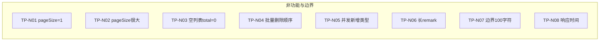

| 编号 | 测试点名称 |
|------|------------|
| TP-N01 | 分页 pageSize=1 时仅返回一条 |
| TP-N02 | 分页 pageSize 为较大值时的行为与限制 |
| TP-N03 | 无数据时 total=0、rows 为空数组 |
| TP-N04 | 批量删除时顺序或部分失败时的原子性/提示 |
| TP-N05 | 并发新增不同类型时唯一性仍保证 |
| TP-N06 | remark 长文本（边界或超长） |
| TP-N07 | dictName/dictType/dictLabel/dictValue 恰为 100 字符 |
| TP-N08 | 列表接口响应时间在可接受范围（可选） |

---

## 测试点汇总统计

| 模块 | 数量 |
|------|------|
| 字典类型-列表与查询 | 18 |
| 字典类型-新增 | 15 |
| 字典类型-修改 | 14 |
| 字典类型-删除 | 10 |
| 字典类型-导出与 optionselect | 6 |
| 字典数据-列表与查询 | 12 |
| 字典数据-新增 | 12 |
| 字典数据-修改与删除 | 12 |
| 缓存与联动 | 8 |
| 权限与异常 | 12 |
| 非功能与边界 | 8 |
| **合计** | **125** |
