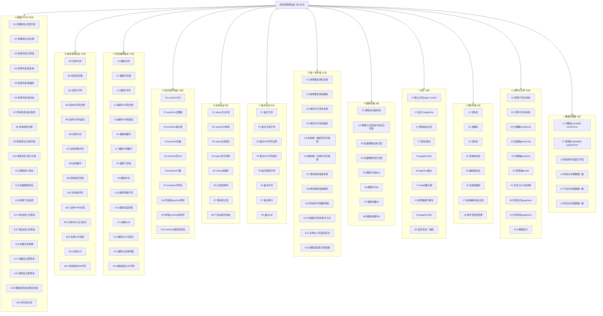

# 岗位管理测试点设计（120+）

## 测试点总览 Mermaid 图

## 各类别测试点明细

### A. 基础 CRUD（20 点）

| 编号 | 测试点描述 |
|------|------------|
| A1 | 创建岗位时填写全部字段（岗位名称、编码、显示顺序、状态、备注），提交后返回成功且列表可查到。 |
| A2 | 创建岗位时仅填写必填项（岗位名称、编码、显示顺序），状态默认正常，提交成功。 |
| A3 | 调用岗位列表接口不传任何筛选条件，返回分页数据及 total。 |
| A4 | 列表接口传入 postName 筛选，返回名称匹配的岗位。 |
| A5 | 列表接口传入 postCode 筛选，返回编码匹配的岗位。 |
| A6 | 列表接口传入 status=0 或 1，返回对应状态的岗位。 |
| A7 | 列表接口同时传入名称、编码、状态，返回同时满足条件的岗位。 |
| A8 | 根据岗位 ID 查询岗位详情，返回该岗位完整信息。 |
| A9 | 修改岗位时更新全部可编辑字段，提交成功且详情与修改内容一致。 |
| A10 | 修改岗位时仅更新部分字段（如仅改名称），其他字段保持不变。 |
| A11 | 删除单个岗位（未分配用户），删除成功且详情不可查。 |
| A12 | 删除多个岗位（传逗号分隔的 postIds），全部未分配时批量删除成功。 |
| A13 | 调用 optionselect 接口，返回全部岗位列表（无分页）。 |
| A14 | 导出岗位不传筛选条件，导出成功。 |
| A15 | 导出岗位传入名称或状态等筛选条件，导出结果与筛选一致。 |
| A16 | 完整流程：创建 → 列表/详情 → 修改 → 再查 → 删除，每步成功。 |
| A17 | 创建岗位后立即调用列表接口，新岗位出现在列表中。 |
| A18 | 修改岗位后立即调用详情接口，详情为修改后的数据。 |
| A19 | 删除岗位后调用详情接口，返回错误或空。 |
| A20 | 无任何岗位时调用列表，返回空列表且 total=0。 |

### B. 岗位名称验证（15 点）

| 编号 | 测试点描述 |
|------|------------|
| B1 | 岗位名称为空字符串，接口返回校验错误（岗位名称不能为空）。 |
| B2 | 岗位名称仅包含空格，按业务规则校验是否视为无效。 |
| B3 | 岗位名称长度为 1 个字符，允许创建。 |
| B4 | 岗位名称长度恰好为 50 个字符（边界），允许创建。 |
| B5 | 岗位名称长度为 51 个字符，返回长度超限错误。 |
| B6 | 岗位名称为中文，正常创建与展示。 |
| B7 | 岗位名称包含特殊字符（如 !@#），根据业务规则校验。 |
| B8 | 岗位名称纯数字，允许创建。 |
| B9 | 岗位名称前后带空格，校验是否 trim 或报错。 |
| B10 | 岗位名称包含换行符，校验存储与展示。 |
| B11 | 岗位名称包含 HTML 标签，校验转义或拒绝。 |
| B12 | 岗位名称包含 SQL 注入特征字符，校验安全处理。 |
| B13 | 岗位名称包含 XSS 特征字符，校验安全处理。 |
| B14 | 岗位名称传 null 或缺失，返回必填校验错误。 |
| B15 | 岗位名称超长（如 500 字符），返回长度超限错误。 |

### C. 岗位编码验证（15 点）

| 编号 | 测试点描述 |
|------|------------|
| C1 | 岗位编码为空，返回岗位编码不能为空。 |
| C2 | 岗位编码仅空格，校验是否视为无效。 |
| C3 | 岗位编码 1 个字符，允许创建。 |
| C4 | 岗位编码 64 字符边界，允许创建。 |
| C5 | 岗位编码 65 字符，返回超长错误。 |
| C6 | 岗位编码纯数字，允许创建。 |
| C7 | 岗位编码字母+数字，允许创建。 |
| C8 | 岗位编码含下划线，允许创建。 |
| C9 | 岗位编码含中文，根据业务规则校验。 |
| C10 | 岗位编码含特殊字符，根据规则校验。 |
| C11 | 岗位编码前后空格，校验 trim 或报错。 |
| C12 | 岗位编码 null 或缺失，返回必填错误。 |
| C13 | 岗位编码大小写区分：code 与 CODE 视为不同。 |
| C14 | 岗位编码与岗位名称填相同值，允许（若业务允许）。 |
| C15 | 岗位编码超长（如 128 字符），返回超长错误。 |

### D. 显示顺序验证（10 点）

| 编号 | 测试点描述 |
|------|------------|
| D1 | postSort 为 0，允许创建/修改。 |
| D2 | postSort 为正整数（如 1、100），正常。 |
| D3 | postSort 为较大整数（如 2147483647），根据字段类型校验。 |
| D4 | postSort 为负数，返回校验错误。 |
| D5 | postSort 为空或 null，返回显示顺序不能为空。 |
| D6 | postSort 为小数，校验是否取整或报错。 |
| D7 | postSort 为字符串（如 "1"），校验类型处理。 |
| D8 | 列表接口返回数据按 postSort 排序。 |
| D9 | 修改某岗位 postSort 后，列表顺序变化正确。 |
| D10 | 多个岗位 postSort 相同，列表展示稳定不乱序。 |

### E. 状态验证（8 点）

| 编号 | 测试点描述 |
|------|------------|
| E1 | status=0 表示正常，创建/修改成功且列表筛选正确。 |
| E2 | status=1 表示停用，创建/修改成功且列表筛选正确。 |
| E3 | status 传 2 或其他无效值，返回校验错误。 |
| E4 | status 传空字符串，校验默认或报错。 |
| E5 | status 传非数字字符串，返回校验错误。 |
| E6 | 将正常岗位修改为停用，修改成功且状态为 1。 |
| E7 | 将停用岗位修改为正常，修改成功且状态为 0。 |
| E8 | 下拉选项接口返回的岗位包含状态字段或仅正常。 |

### F. 备注验证（8 点）

| 编号 | 测试点描述 |
|------|------------|
| F1 | 备注传空字符串，允许保存。 |
| F2 | 创建/修改时不传 remark 字段，使用默认或空。 |
| F3 | 备注长度恰好 500 字符，允许保存。 |
| F4 | 备注长度 501 字符，返回超长错误（若后端限制）。 |
| F5 | 备注含特殊字符，正常保存与回显。 |
| F6 | 备注含中文，正常保存与回显。 |
| F7 | 备注含换行符，保存与展示正确。 |
| F8 | 备注传 null，按空处理或报错一致。 |

### G. 唯一性约束（12 点）

| 编号 | 测试点描述 |
|------|------------|
| G1 | 新增岗位时岗位名称与已有岗位重复，返回“岗位名称已存在”。 |
| G2 | 新增岗位时岗位编码与已有岗位重复，返回“岗位编码已存在”。 |
| G3 | 修改岗位时将名称改为已存在的其他岗位名称，返回名称已存在。 |
| G4 | 修改岗位时将编码改为已存在的其他岗位编码，返回编码已存在。 |
| G5 | 名称与已有重复但编码不同，仍不允许（名称唯一）。 |
| G6 | 编码与已有重复但名称不同，仍不允许（编码唯一）。 |
| G7 | 修改岗位时不改名称（保持自身名称），允许保存。 |
| G8 | 修改岗位时不改编码（保持自身编码），允许保存。 |
| G9 | 两条岗位名称相同不允许；编码相同也不允许。 |
| G10 | 同编码不同名称不允许（编码全局唯一）。 |
| G11 | 名称/编码唯一性是否区分大小写（如 Abc 与 abc）。 |
| G12 | 删除岗位后，再创建同名同编码岗位，允许。 |

### H. 删除约束（8 点）

| 编号 | 测试点描述 |
|------|------------|
| H1 | 删除未分配任何用户的岗位，删除成功。 |
| H2 | 删除已分配用户的岗位，返回“XX已分配,不能删除”。 |
| H3 | 批量删除多个岗位且均未分配用户，全部删除成功。 |
| H4 | 批量删除时包含已分配用户的岗位，按实现返回部分失败或明确错误。 |
| H5 | 删除不存在的岗位 ID，返回错误或 404。 |
| H6 | 删除岗位 ID 为 0，返回错误。 |
| H7 | 删除岗位 ID 为负数，返回错误。 |
| H8 | 删除时 ID 传非数字（如字符串），返回参数错误。 |

### I. 分页（10 点）

| 编号 | 测试点描述 |
|------|------------|
| I1 | 列表不传分页参数时默认 pageNum=1、pageSize=10，返回第一页。 |
| I2 | 传入 pageSize=5，返回每页 5 条。 |
| I3 | 传入页码超出总页数，返回空列表或最后一页。 |
| I4 | 传入 pageNum=0 或负数，校验报错或按 1 处理。 |
| I5 | pageSize=1，每页 1 条。 |
| I6 | pageSize 极大（如 9999），根据后端限制校验。 |
| I7 | 列表返回的 total 与实际符合筛选条件的总数一致。 |
| I8 | 翻页后各页数据不重复、不遗漏。 |
| I9 | pageSize=0，校验报错或默认值。 |
| I10 | 首页与末页数据条数及 total 一致（边界）。 |

### J. 组合筛选（8 点）

| 编号 | 测试点描述 |
|------|------------|
| J1 | 仅传 postName，结果与名称匹配。 |
| J2 | 仅传 postCode，结果与编码匹配。 |
| J3 | 仅传 status，结果与状态匹配。 |
| J4 | postName + status 组合，结果同时满足。 |
| J5 | postCode + status 组合，结果同时满足。 |
| J6 | postName + postCode 组合，结果同时满足。 |
| J7 | postName + postCode + status 三者组合，结果正确。 |
| J8 | 组合条件无匹配数据时，返回空列表且 total=0。 |

### K. 边界与异常（10 点）

| 编号 | 测试点描述 |
|------|------------|
| K1 | 修改时 postId 为不存在的 ID，返回错误。 |
| K2 | 详情查询不存在的 postId，返回错误或 404。 |
| K3 | 创建时缺少 postName，返回岗位名称不能为空。 |
| K4 | 创建时缺少 postCode，返回岗位编码不能为空。 |
| K5 | 创建时缺少 postSort，返回显示顺序不能为空。 |
| K6 | 修改时缺少 postId，返回参数错误。 |
| K7 | 请求体非法 JSON，返回 400 或解析错误。 |
| K8 | 列表传入非法 pageNum（如非数字），校验处理。 |
| K9 | 列表传入非法 pageSize（如非数字），校验处理。 |
| K10 | 删除时 ID 为空或未传，返回参数错误。 |

### L. 数据完整性（6 点）

| 编号 | 测试点描述 |
|------|------------|
| L1 | 创建岗位后，详情或列表中包含 createBy、createTime 且合理。 |
| L2 | 修改岗位后，详情或列表中包含 updateBy、updateTime 且更新。 |
| L3 | 仅修改一个字段（如备注）时，其他字段（名称、编码、顺序、状态）不变。 |
| L4 | 列表某条与根据 postId 查详情的数据一致。 |
| L5 | 下拉选项与列表（或详情）中岗位数据一致。 |
| L6 | 导出结果与当前筛选条件下的列表数据一致。 |

---

**合计：A20 + B15 + C15 + D10 + E8 + F8 + G12 + H8 + I10 + J8 + K10 + L6 = 120 个测试点**
